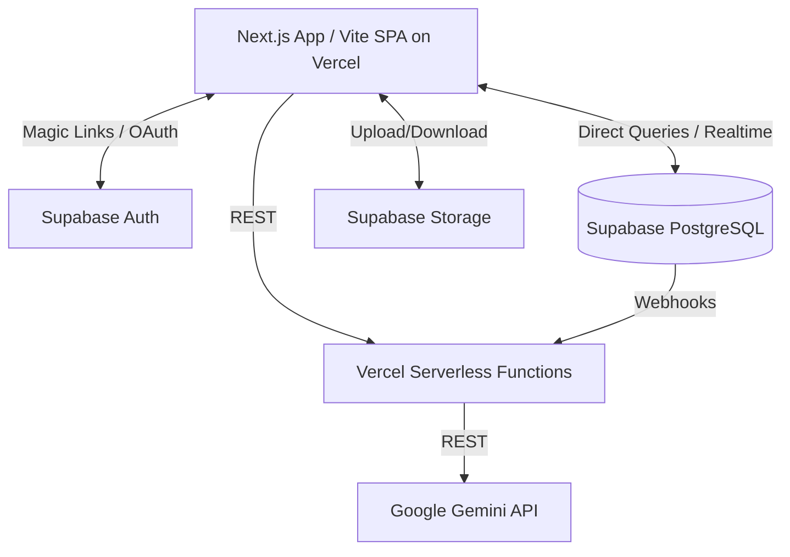

# System Design & Architecture: Supabase & Vercel Migration

## Architecture Overview

This migration transitions the Óculos Solidários prototype from local state (Zustand) and a local Express server to a robust, serverless architecture using Supabase (BaaS) and Vercel.

**Key Components and Responsibilities:**
- **Frontend (Vercel):** Hosts the user interface. Can be Vite (SPA) or Next.js (App Router, recommended for SEO and Server Actions). Manages routing and UI state.
- **Supabase Auth:** Handles user authentication, issuing JWTs, validating emails, and Magic Links.
- **Supabase DB (PostgreSQL):** The source of truth for `users`, `ads`, `prescription_requests`, `ratings`. Protected by Row Level Security (RLS) policies. Includes PostGIS for geolocation.
- **Supabase Storage:** Manages binary assets. Contains `public-glasses` (public bucket) and `private-prescriptions` (private bucket protected by RLS).
- **Vercel Serverless Functions / Next.js Server Actions:** Secure execution environment for sensitive logic, such as AI moderation via Gemini.

## Data Models

The data is modeled in PostgreSQL with strict constraints and enums:

- **users:** Core profile information (`id` tied to `auth.users`, `email`, `name`, location, `rating`).
- **ads:** Eyeglass donation or exchange listings (`user_id`, `type`, `status`, `photo_urls`, location).
- **prescription_requests:** Requests for glasses with sensitive documents (`user_id`, `patient_name`, `prescription_photo_url`, `document_photo_url`, `donor_id`).
- **ratings:** User-to-user review system.

**Relationships:**
- Users can have many Ads (`ads.user_id -> users.id`).
- Users can have many Prescription Requests (`prescription_requests.user_id -> users.id`).
- Ads and Requests can be matched via donors (`prescription_requests.donor_id -> users.id`).
- Ratings link two users (`from_user_id` and `to_user_id`).

## API Design & Interfaces

- **Client to DB:** The frontend uses `@supabase/supabase-js` to directly query PostgreSQL via the PostgREST API.
- **Realtime:** Subscriptions on `ads` or `messages` (future) for live UI updates.
- **AI Moderation API:**
  - *Input:* Ad text and metadata.
  - *Processing:* Vercel function calls Gemini API to ensure content is safe/appropriate.
  - *Output:* Approves (`status = active`) or blocks (`status = blocked`) the ad. Can be implemented as a Supabase Database Webhook to decouple from UI latency.

## Design Decisions & Trade-offs

- **Framework Migration:**
  - *Decision:* Migrate the current Vite SPA to Next.js (App Router).
  - *Rationale:* Next.js enables Server Actions (hiding Gemini API keys easily) and Server-Side Rendering (critical for SEO sharing of ads), providing a better long-term foundation.
- **Direct DB Access via RLS vs. Custom Backend:** 
  - *Decision:* Use Supabase client with RLS.
  - *Rationale:* Significantly reduces backend code, accelerates development, but requires careful RLS policy writing.
- **AI Moderation (Synchronous API vs. Webhooks):**
  - *Decision:* Move AI moderation to a Supabase Database Webhook to a Vercel function.
  - *Rationale:* The user doesn't wait for Gemini to respond. Ad starts as `review`, and updates to `active` when the webhook completes asynchronously.
- **Geolocation Implementation:**
  - *Decision:* Add `latitude` and `longitude` fields to both `users` and `ads` schemas (to be updated in migration).
  - *Rationale:* Facilitates PostGIS radius queries (e.g., `ST_DWithin`) required for the map feature.
- **Chat & Messaging Scope:**
  - *Decision:* Defer the chat and messaging schema (and Realtime sync) to a later phase.
  - *Rationale:* Keeps the scope of the MVP migration focused and manageable.

## Non-Functional Requirements

- **Security:** RLS must strictly isolate private prescriptions (`private-prescriptions` bucket and `prescription_requests` rows) to the patient and authorized donor.
- **Performance:** Edge caching on Vercel for static assets. Database queries should be indexed on location (PostGIS).
- **Scalability:** Serverless architecture scales automatically to zero and handles traffic spikes seamlessly.
